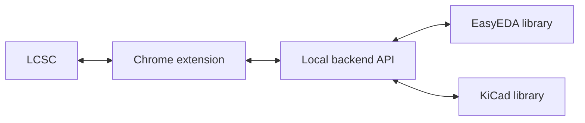

# easyeda2kicad companion

Convert EasyEDA/LCSC components into KiCad libraries and manage them from a Chrome extension. This repository now combines the core EasyEDA conversion project, a local backend API, and a browser extension that can create or update library files on your machine.

> [!WARNING]
> EasyEDA source data can contain issues. ALWAYS CHECK PINS AND FOOTPRINTS before using converted parts in production designs.

## Introduction
This repo connects the LCSC catalog, a Chrome extension UI, and a local backend so you can generate and update KiCad libraries on your machine. The backend coordinates EasyEDA data fetching and KiCad export, while the extension provides the workflow inside your browser.



## What is included
- `easyeda2kicad/`: Python conversion engine and CLI.
- `run_server.py`: FastAPI backend for the extension.
- `chrome_extension/`: Chrome MV3 extension UI that talks to the local backend.

## Quick start
1. Create a virtual environment and install in editable mode:
   ```bash
   python -m venv env
   source env/bin/activate
   python setup.py develop
   ```
2. Start the backend:
   ```bash
   python run_server.py --host 0.0.0.0 --port 8087
   ```
3. Load the extension:
   - Open `chrome://extensions`, enable Developer mode, click "Load unpacked".
   - Select the `chrome_extension/` folder.
4. Browse `https://www.lcsc.com/` and use the extension to export components.

## CLI usage (optional)
Generate libraries directly from the command line:
```bash
easyeda2kicad --full --lcsc_id=C2040
easyeda2kicad --symbol --footprint --3d --lcsc_id=C2040
easyeda2kicad --symbol --lcsc_id=C2040 --v5
```

## Library output
By default, libraries are saved under:
- Windows: `C:/Users/your_name/Documents/Kicad/easyeda2kicad/`
- Linux: `/home/your_name/Documents/Kicad/easyeda2kicad/`

Override the destination with:
```bash
easyeda2kicad --full --lcsc_id=C2040 --output ~/libs/my_lib
```

## Project layout
- `easyeda2kicad/api/`: FastAPI server routes.
- `easyeda2kicad/easyeda/`: EasyEDA parsing and fetching.
- `easyeda2kicad/kicad/`: KiCad export logic.
- `easyeda2kicad/service/`: Conversion orchestration.
- `tests/`: API and conversion tests.
- `ressources/` and `samples/`: images and examples.

## Configuration
- Backend host/port are controlled by `HOST` and `PORT` or `run_server.py` args.
- The extension expects the backend at `http://localhost:8087`. If you change the port, update `chrome_extension/manifest.json`.

> [!NOTE]
> This repo includes fixes for several EasyEDA conversion edge cases and improves overall stability when exporting libraries.

## Development notes
- Run tests:
  ```bash
  python -m unittest discover -s tests
  ```
- Code style: Black (88), isort, flake8, pycln, bandit, and Prettier for JS/CSS/HTML.
- Pre-commit hooks are configured in `.pre-commit-config.yaml`.

## License
AGPL-3.0. See `LICENSE`.
