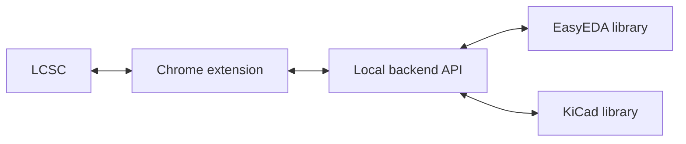
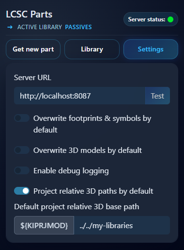
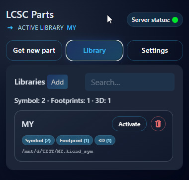
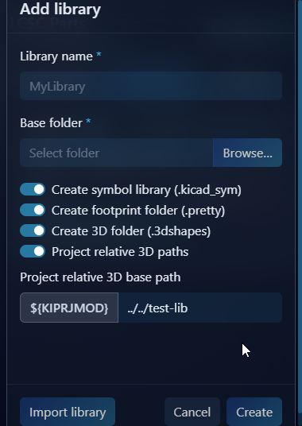
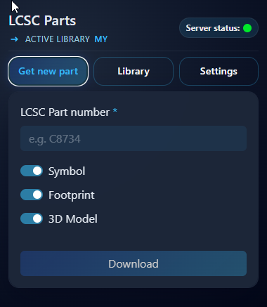
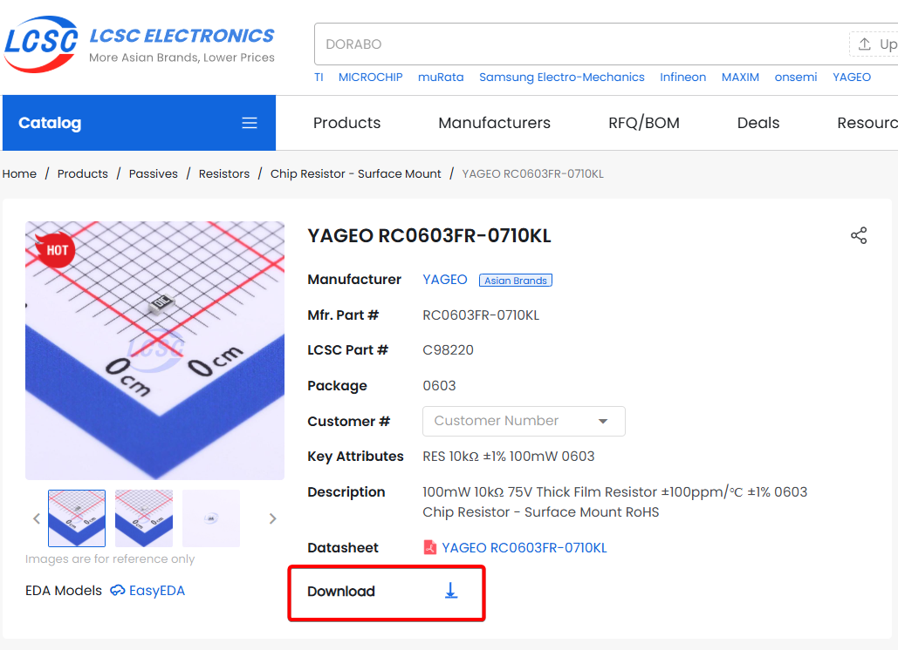
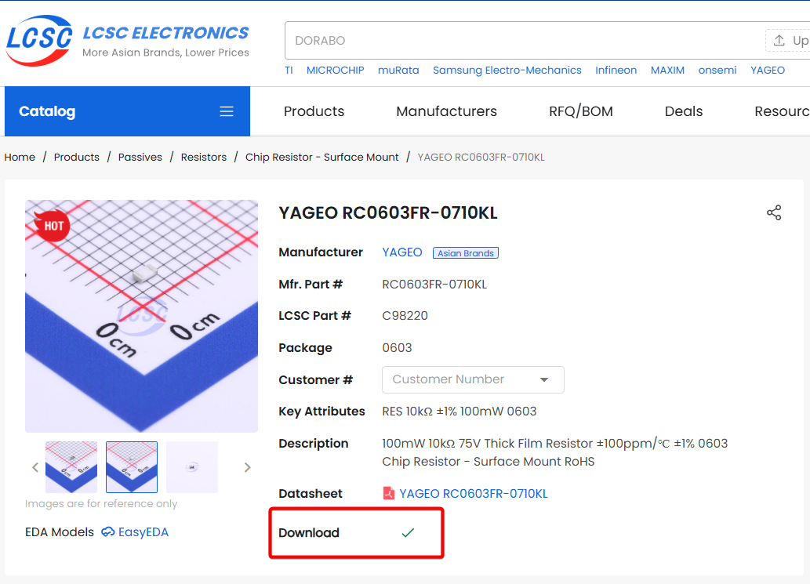
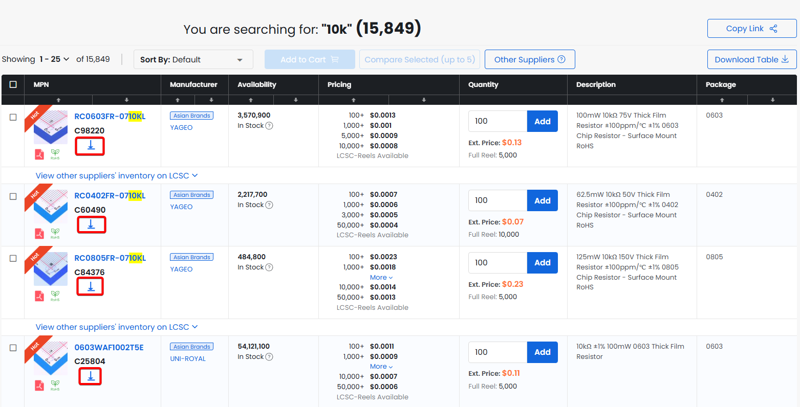

# easyeda2kicad companion

Convert EasyEDA/LCSC components into KiCad libraries and manage them from a Chrome extension. This repository now combines the core EasyEDA conversion project, a local backend API, and a browser extension that can create or update library files on your machine.

> [!WARNING]
> EasyEDA source data can contain issues. ALWAYS CHECK PINS AND FOOTPRINTS before using converted parts in production designs.

## Introduction
This repo connects the LCSC catalog, a Chrome extension UI, and a local backend so you can generate and update KiCad libraries on your machine. The backend coordinates EasyEDA data fetching and KiCad export, while the extension provides the workflow inside your browser.



## What is included
- `easyeda2kicad/`: Python conversion engine and CLI.
- `run_server.py`: FastAPI backend for the extension.
- `chrome_extension/`: Chrome MV3 extension UI that talks to the local backend.

## Quick start
1. Create a virtual environment and install in editable mode:
   ```bash
   python -m venv env
   source env/bin/activate
   python setup.py develop
   ```
2. Start the backend:
   ```bash
   python run_server.py --host 0.0.0.0 --port 8087
   ```
3. Load the extension:
   - Open `chrome://extensions`, enable Developer mode, click "Load unpacked".
   - Select the `chrome_extension/` folder.
4. Browse `https://www.lcsc.com/` and use the extension to export components.

## UI and LCSC Website Integration
| Extension settings |
| --- |
|  |
| Configure backend URL, overwrite defaults, and project-relative paths. |

| Library management |
| --- |
|  |
| View existing libraries, counts, and status badges. |

| Add a library |
| --- |
|  |
| Create a new library and choose output folders. |

| Fetch new parts |
| --- |
|  |
| Request symbols, footprints, and 3D models from LCSC IDs. |

| LCSC part page action |
| --- |
|  |
| Download a single part directly from the product page. |

| LCSC part downloaded |
| --- |
|  |
| Confirms the part is available in the library. |

| LCSC list actions |
| --- |
|  |
| Quick download buttons added to LCSC listing pages. |


## Project layout
- `easyeda2kicad/api/`: FastAPI server routes.
- `easyeda2kicad/easyeda/`: EasyEDA parsing and fetching.
- `easyeda2kicad/kicad/`: KiCad export logic.
- `easyeda2kicad/service/`: Conversion orchestration.
- `tests/`: API and conversion tests.

## Configuration
- Backend host/port are controlled by `HOST` and `PORT` or `run_server.py` args.
- The extension expects the backend at `http://localhost:8087`. If you change the port, update `chrome_extension/manifest.json`.

> [!NOTE]
> This repo includes fixes for several EasyEDA conversion edge cases and improves overall stability when exporting libraries.

## Development notes
- Run tests:
  ```bash
  python -m unittest discover -s tests
  ```
- Code style: Black (88), isort, flake8, pycln, bandit, and Prettier for JS/CSS/HTML.
- Pre-commit hooks are configured in `.pre-commit-config.yaml`.

## Credits
This project builds on the original easyeda2kicad work by uPesy: https://github.com/uPesy/easyeda2kicad.py


## License

> [!NOTE]
> This repository includes code from the original AGPL-3.0 project, so the AGPL-3.0 license applies to that code. My intent for new contributions is "free to use, non-commercial only"; this note does not change the licensing of the original code.
> 
AGPL-3.0. See `LICENSE`.
